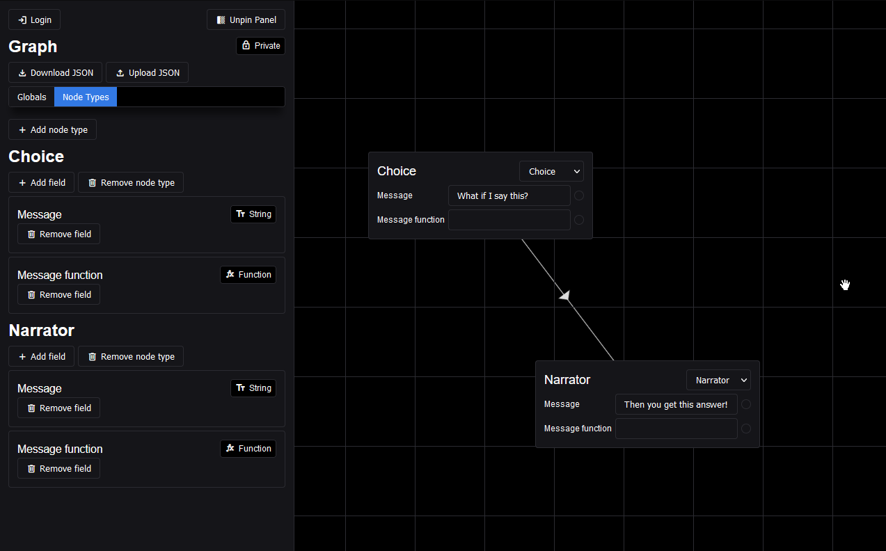
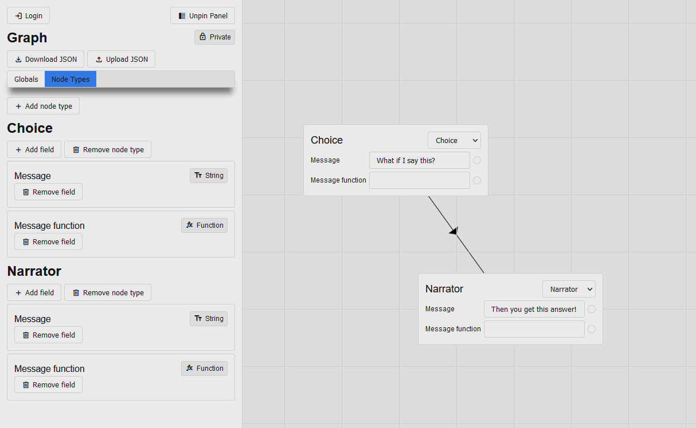

# How to start

1. Clone the repository
2. Copy `example.env` to `.env` and fill in the values
3. Run `npm install`
4. Run `npm start`
5. Open your browser and go to `http://localhost:3000/`

# Screenshots

## Dark mode

## Light mode

# How to use

## Adding a node

- Right-click on the canvas.
- Click "Add node".

## Removing a node

- Right-click a node.
- Click "Remove node".

## Removing multiple nodes

- Drag while holding left mouse button to select multiple nodes.
- Right-click on the canvas.
- Click "Remove selected nodes".

## Connecting nodes

- Double-click on a node.
- Click the node you want to connect to.

**Alternatively**, you can also right-click on a node and click "Connect".

## Connecting fields

- Click the circle next to a field or double-click the input of the field.
- Click the field you want to connect to.

## Shortcuts

`t` - Toggle theme

`g` - Toggle grid

`c` - Toggle connection lines between fields

# How do functions work?

When detecting "Date.now()" inside a function, the function will be updated every 100ms.
This is paused if any input has focus and in some other cases.

# Exporting and importing

You can export and import your graph by clicking the "Download JSON" and "Upload JSON" buttons respectively.
