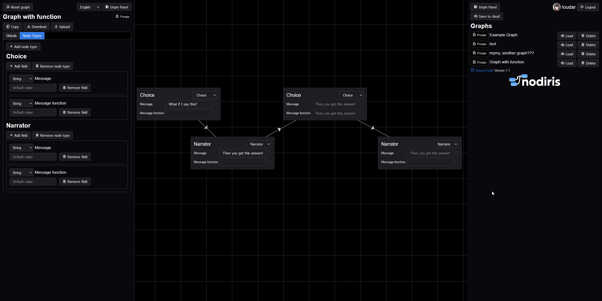

# How to start

1. Clone the repository
2. Copy `example.env` to `.env` and fill in the values
3. Run `npm install`
4. Run `npm start`
5. Open your browser and go to `http://localhost:3000/`

# Screenshots

## Dark mode


# How to use

## Adding a node

- Right-click on the canvas.
- Click "Add node".

## Removing a node

- Right-click a node.
- Click "Remove node".

## Removing multiple nodes

- Drag while holding left mouse button to select multiple nodes.
- Right-click on the canvas.
- Click "Remove selected nodes".

## Connecting nodes

- Double-click on a node.
- Click the node you want to connect to.

**Alternatively**, you can also right-click on a node and click "Connect".

## Connecting fields

- Click the circle next to a field or double-click the input of the field.
- Click the field you want to connect to.

## Shortcuts

`g` - Toggle grid

`c` - Toggle connection lines between fields

# How do functions work?

## Available Variables

`i` - Input values

`s` - Own value (the function text itself)

`t` - Current time

`f` - The current field object

## Time

When detecting "Date.now()" inside a function, the function will be updated every 100ms.
This is paused if any input has focus and in some other cases.

# Exporting and importing

You can export and import your graph by clicking the "Download JSON" and "Upload JSON" buttons respectively.

When the deployed instance supports authentication, you can also save your graph to the server by clicking the "Save to cloud" button.

# Available languages

- English
- German

# Credits

- Font used in Logo - [Excon by Indian Type Foundry](https://www.fontshare.com/fonts/excon)

# CI/CD

## Set up Github Actions Secrets

- `REGISTRY_HOST` - The host of the registry (e.g. `ghcr.io`)
- `REGISTRY_USER` - The username of the registry
- `REGISTRY_PASS` - The password for the given username

## Deployment

The `docker-image.yml` workflow will push the image to the registry on every push to the `main` branch.
You can then deploy it with a docker-compose file like this:

```yaml
services:
  nodiris:
    image: ${REGISTRY_HOST}/${IMAGE_NAME}:latest
    container_name: NODIRIS
    restart: always
    environment:
        - DEPLOYMENT_URL=${DEPLOYMENT_URL}
        - MYSQL_URL=${MYSQL_URL}
        - MYSQL_USER=${MYSQL_USER}
        - MYSQL_PASSWORD=${MYSQL_PASSWORD}
        - SESSION_SECRET=${SESSION_SECRET}
    ports:
      - "${PORT_NODIRIS}:3001"
```